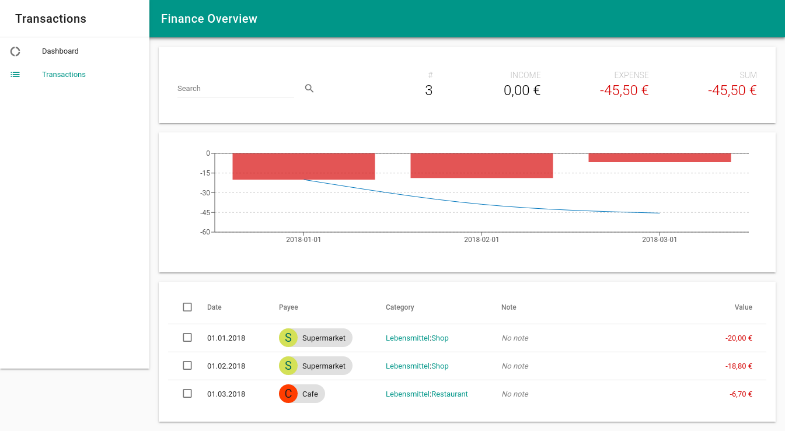

# Finance overview

Visualizer for transactions from the Android app [MyExpenses](https://play.google.com/store/apps/details?id=org.totschnig.myexpenses)

## Requirements

* NPM

## Getting started

* Install dependencies: `npm install`
* Enable test data: `cp src/data/transactions-example.json src/data/transactions.json`
* Convert to JSON: `csv2json Ausgaben-YYYYMMDD.csv > src/data/transactions.json`
* Start app: `npm start`

## Screenshot

